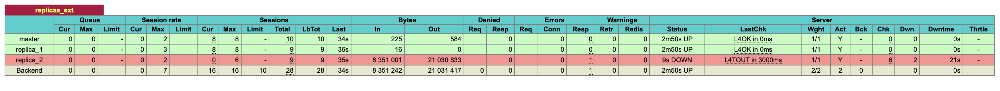

# Балансировка  
Данная домашняя работа была направлена на изучение балансировки в высоконагруженных системах. В рамках домашней работы были выполнены следующие пункты:
1. Развернут контейнер `HAProxy` для балансировки нагрузки к базе данных
2. Выделены несколько бэкендов в рамках конфигурации `HAProxy` для возможности ходить отдельно к мастеру, реплике и также был добавлен бэкенд `replicas_ext` для возможности ходить на мастера для запросов на чтение
3. Было развернуто несколько версий самого приложения `social-network`
4. Был развернут `nginx`-сервер для балансировки соединений к приложению
5. Было проведено нагрузочное тестирование подсистемы диалогов(ввиду наличия данных скриптов) и рассмотрены следующие случаи:
    1. Отключена одна из реплик базы данных для возможности убедиться, что `HAProxy` перенапрвляет соединения на работающие узлы и система остается рабочей
    2. Отключена одна из версий приложения для возможности убедиться, что `nginx` перенаправляет соединения только к работающим версиям приложения и система остается рабочей

## HAProxy
Конфиг:
```sql
global
	maxconn 100
    log stdout local0 debug

defaults
	log	global
	mode	tcp
	retries 2
	timeout client 30m
	timeout connect 4s
	timeout server 30m
	timeout check 5s

listen stats
	mode http
	bind *:7000
	stats enable
	stats uri /

listen master
	bind *:6432
    option tcp-check
    default-server inter 3s fall 3 rise 2 on-marked-down shutdown-sessions
    server master 172.16.238.91:5432 check port 5432

frontend replicas
    bind *:6433
    acl use_leader_as_replica always_true
    use_backend replicas_ext if use_leader_as_replica
    default_backend replicas_only

backend replicas_only
    balance roundrobin
    option tcp-check
    default-server inter 3s fall 3 rise 2 on-marked-down shutdown-sessions
    server replica_1 172.16.238.92:5432 check port 5432
    server replica_2 172.16.238.93:5432 check port 5432

backend replicas_ext
    balance roundrobin
    option tcp-check 
    default-server inter 3s fall 3 rise 2 on-marked-down shutdown-sessions
    server master 172.16.238.91:5432 check port 5432
    server replica_1 172.16.238.93:5432 check port 5432
    server replica_2 172.16.238.92:5432 check port 5432
```

Скриншоты нагрузки из статистики `haproxy`:
Replica on:
 
Replica off:


Logs:


По скриншотам видно, что нагрузка перераспределилась.

## Nginx
Конфиг:
```sql
worker_rlimit_core  500M;
pid /var/run/nginx.pid;

error_log /var/log/nginx/crit.log crit;
error_log /var/log/nginx/error.log error;

worker_rlimit_nofile 400000;
worker_processes 1;

events {
  use epoll;
  worker_connections 200000;
  multi_accept on;
}

http {
  access_log   /var/log/nginx/access.log  combined;

  client_body_buffer_size 8k;
  client_header_buffer_size 4k;
  client_max_body_size 1m;
  large_client_header_buffers 2 1k;

  keepalive_timeout 7200s;
  keepalive_requests 200000000;

  client_body_timeout 20;
  send_timeout 20;

  tcp_nopush on;
  tcp_nodelay on;

  index index.html index.htm;
  include mime.types;
  default_type application/json;

  upstream backend {
    server 172.16.238.95:8083;
    server 172.16.238.103:8083;
  }

  server {
    listen 8070; 
    location / {
        proxy_pass http://backend;
    }
  }
}
```
Cоединения направляются на порт `:8070`.

При отключении одной из версий приложения, `nginx` логирует ошибку `Connection refused` в логи сервиса. Приведены только отдельные выкладки из логов ввиду большого объема оных. 

Logs:


## Выводы и возможные улучшения
Видно, что `HAProxy` и `nginx` справляются с балансировкой приложений и БД, а производительность, хоть и cнижается при отключении узлов, но система продолжает выдерживать нагрузку.

В рамках данной работы использовалась полностью монолитная версия приложения и по этой причине не представлена возможность отправлять логи `HAProxy` в `LogStash` и анализировать их через `Kibana`, но такой вариант решения данной задачи также возможен.

## Запуск системы
Запуск:
`make docker-reset && make docker-init && make docker-haproxy && make docker-backend && make docker-run && make docker-run-2`

Нагрузка:
`make perf-test-dialogs-send`