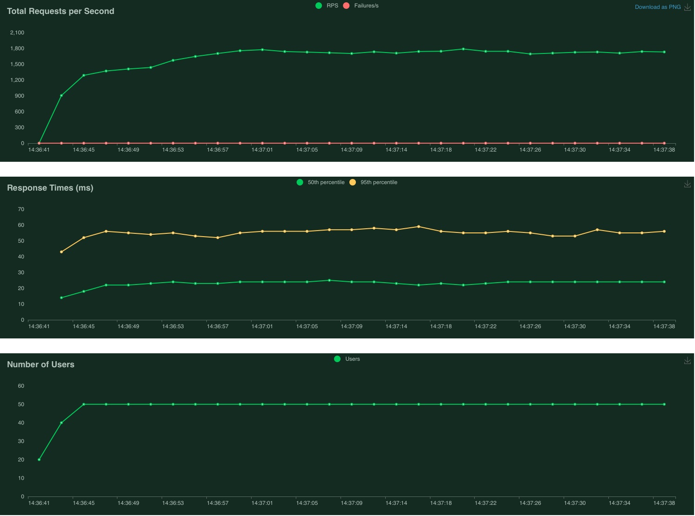
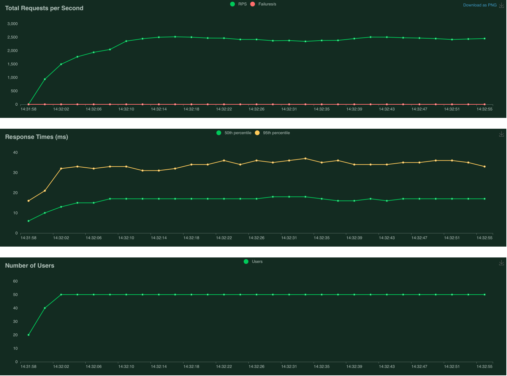
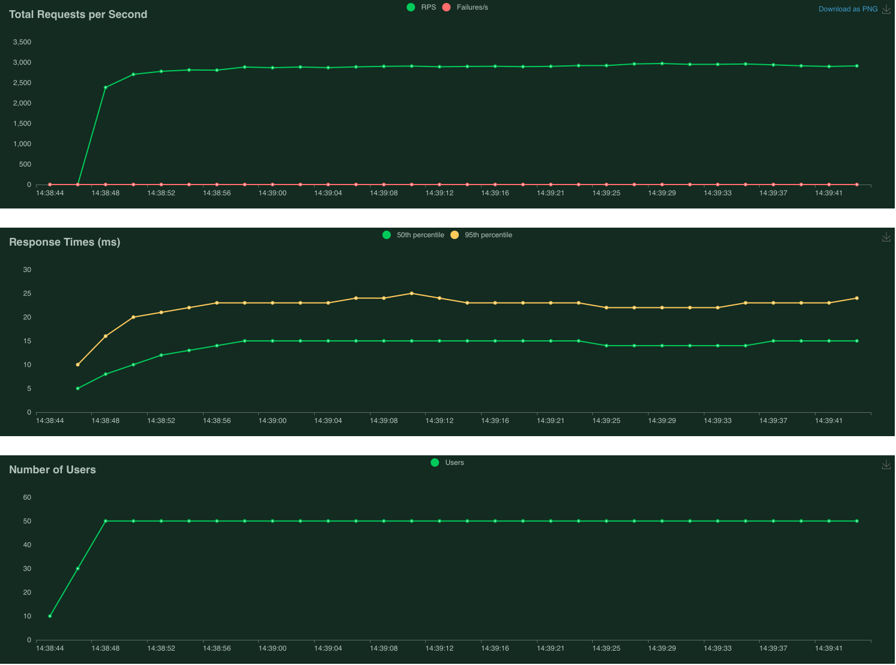
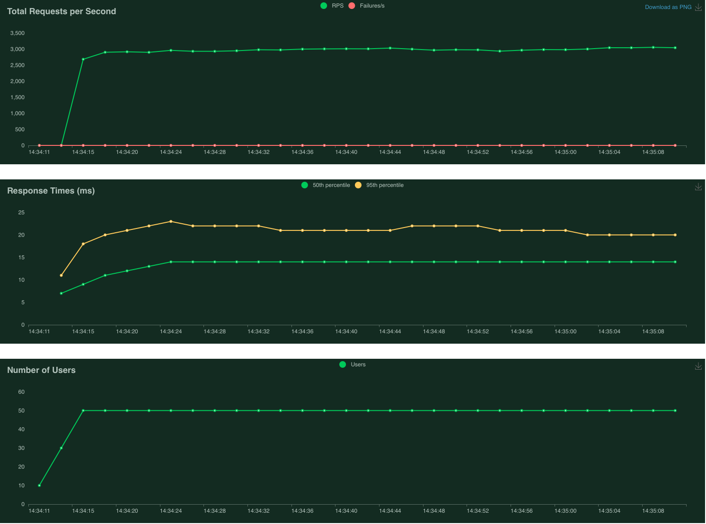

# In-memory базы данных  
## Общее описание 
Данная домашняя работа была направлена на изучение in-memory баз данных. В качестве основной технологии был выбран Tarantool. В рамках данного задания были выполнены следующие действия:
1. Был развернут сервер Тарантула версии 2.11
2. Была модифицирована система диалогов для хранения переписок на сервере Тарантула
3. Были модифицированы эндпоинты `/dialog/:id/send`, `/dialog:id/list` для перенаправления запросов в Тарантул
    1. Был использован официальный коннектор `go-tarantool`
    2. Для вызова процедур на `Lua` был использован метод `NewCallRequest()`
4. Было проведено нагрузочное тестирование методов `/dialog/:id/send` и `/dialog:id/list` для версии кода с хранением диалогов в `PostgreSQL` и `Tarantool` сооветственно
5. Выводы по нагрузочному тестированию описаны ниже

Схема базы данных(`Tarantool`):
```lua
box.cfg{listen=3301}

dialogs = box.schema.create_space('dialogs')

dialogs:format({
    { name = 'id', type = 'string' },
    { name = 'author_id', type = 'string' },
    { name = 'recepient_id', type = 'string' },
    { name = 'dialog_id', type = 'string' },
    { name = 'created_at', type = 'unsigned' },
    { name = 'text', type = 'string' },

})

dialogs:create_index(
    'primary', { parts={ {'id'}} }
)

dialogs:create_index('dialog', { parts = { { 'dialog_id' } }, unique = false })

uuid = require('uuid')

function send_message(authorID, recepientID, dialogID, text)
    dialogs:insert{uuid.str(), authorID, recepientID, dialogID, os.time(os.date("!*t")), text}
end

function get_dialog(dialog_id)
    return dialogs.index.dialog:select{dialog_id}
end

```

Для запуска стенда следует использовать следующие команды:
`make docker-reset && make docker-citus && make docker-cache && make docker-tt && make docker-backend && make docker-run`

`Docker-compose` файл для поддержки `Tarantool` - `docker-compose.yaml`.

Сервер доступен на `http://localhost:8083/`

## Нагрузочное тестирование
Было проведено нагрузочное тестирование методов  `/dialog/:id/send` и `/dialog:id/list`. Для нагрузочного тестирования использовался фреймворк `Locust`, предварительно система была инициализирована данными пользователей. Нагрузка проверялась на `50` одновременных пользователях в течение `1` минуты.
### Нагрузка на запись(`/dialog/:id/send`)
PostgreSQL              |  Tarantool
:-------------------------:|:-------------------------:
 | 

Видно, что вызов метода `/dialog/:id/send` в PostgreSQL требует больше ресурсов, что снижает RPS и увеличивает время ответа на запрос. Tarantool быстрее отрабатывает на данном запросе ввиду более эффективной стратегии хранения данных в памяти.

### Нагрузка на чтение(`/dialog:id/list`)
PostgreSQL              |  Tarantool
:-------------------------:|:-------------------------:
 | 

При чтении данных(метод `/dialog:id/list`) также видим некоторый прирост эффективности при работе с Tarantool в сравнении с PostgreSQL, но он не так ощутим ввиду наличия механизомов кеширования в самом PostgreSQL.