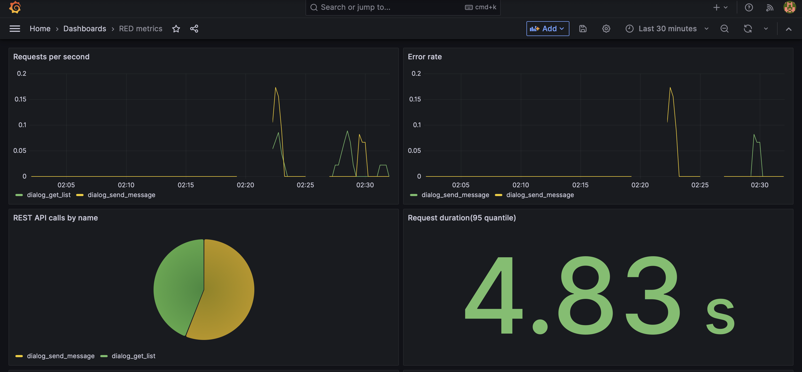
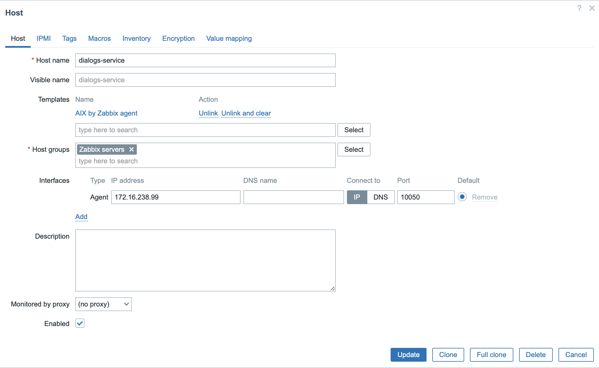
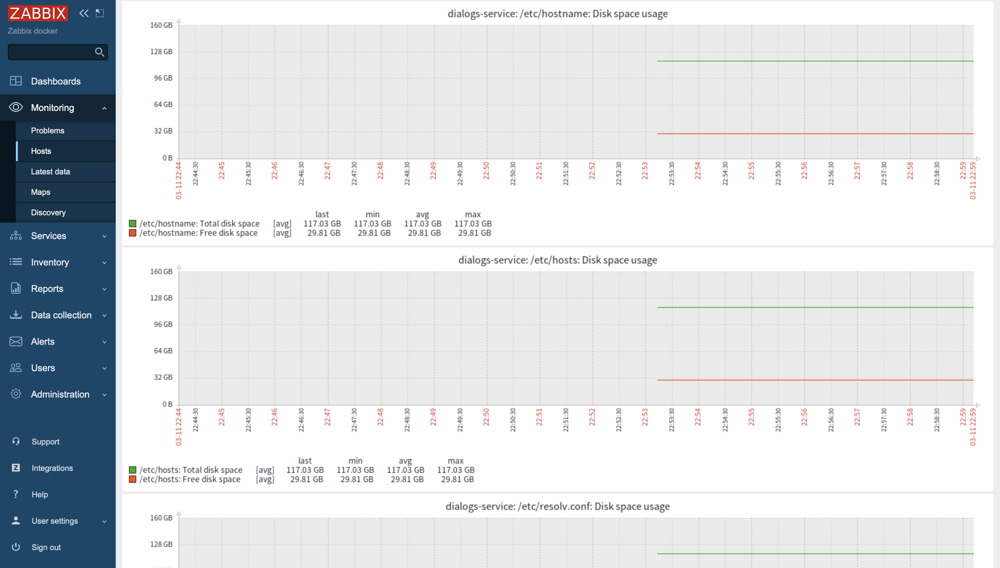
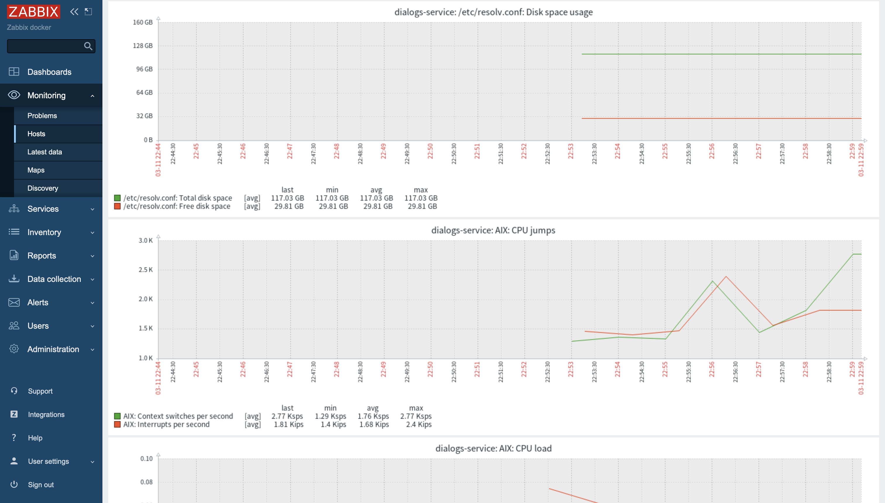
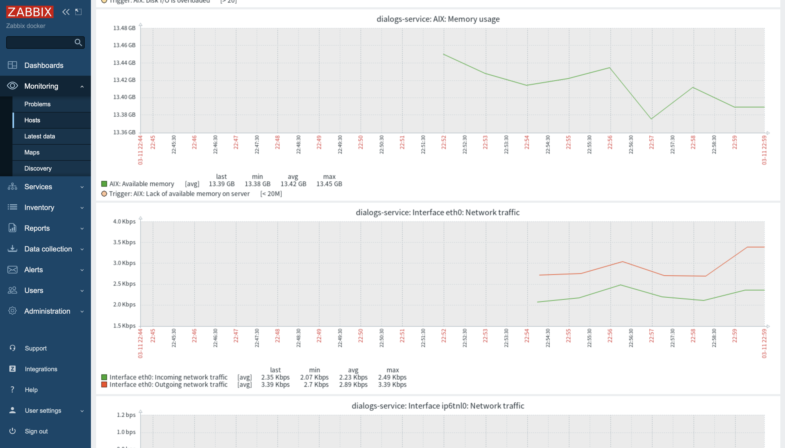

# Мониторинг  
Данная домашняя работа была направлена на изучение возможностей мониторинга Zabbix и Prometheus+Grafana.

## Бизнес-метрики
Бизнес-метрики сервиса диалогов собираются по методу RED(Rate, Error, Duration) и могут быть получены Prometheus-ом на эндпоинте `/metrics`. Следующие метрики собираются в рамках выполненной домашней работы:
1. `social_http_requests_total` - совокупное число запросов `/dialog/{user_id}/send` и `/dialog/{user_id}/list` с информацией о кодах возврата и типе метода
2. `latency` - время ответа на запрос с информацией о типе метода

В рамках стенда был развернут сервер Prometheus, который собирает метрики с эндпоинта `/metrics` сервиса диалогов, был развернут сервер графаны и добавлен дашборд Dialogs RED. 

###Конфигурация Prometheus

```yaml
global:
  scrape_interval:     15s
  evaluation_interval: 15s

scrape_configs:
  - job_name: prometheus
    static_configs:
      - targets: ['localhost:9090']

  - job_name: dialogs-service
    metrics_path: /api/v2/metrics
    static_configs:
      - targets: ['172.16.238.99:8086']

```

### Дашборд RED

Следующие графики были добавлены на дашборд:
1. Requests per second - количество запросов в секунду в зависимости от типа эндпоинта
2. Error rate - количество ошибок в секунду в зависимости от типа эндпоинта
3. Request duration - 95 персентиль времени выполнения запроса




## Технические(системные) метрики
Для сбора технических метрик был развернут zabbix-сервер и в докер-контейнере с подсистемой диалогов был развернут агент zabbix. Системные метрики собираются агентом zabbix и хранятся на сервере. Zabbix позволяет добавить хосты под мониторинг и выбрать желаемые темплейты для дашбордов.

###Добавление хоста под мониторинг



###Дашборд с системными метриками



