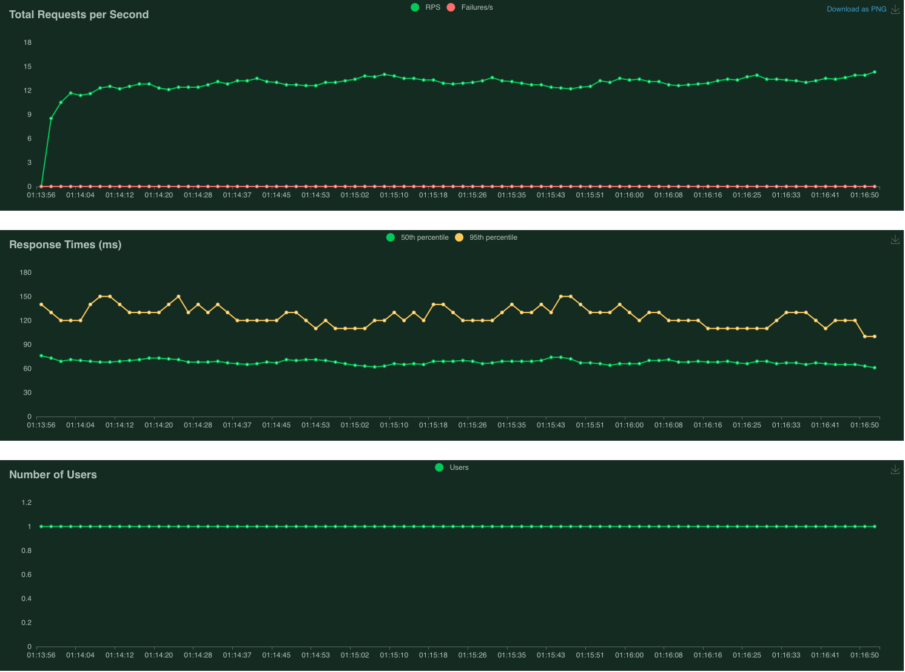
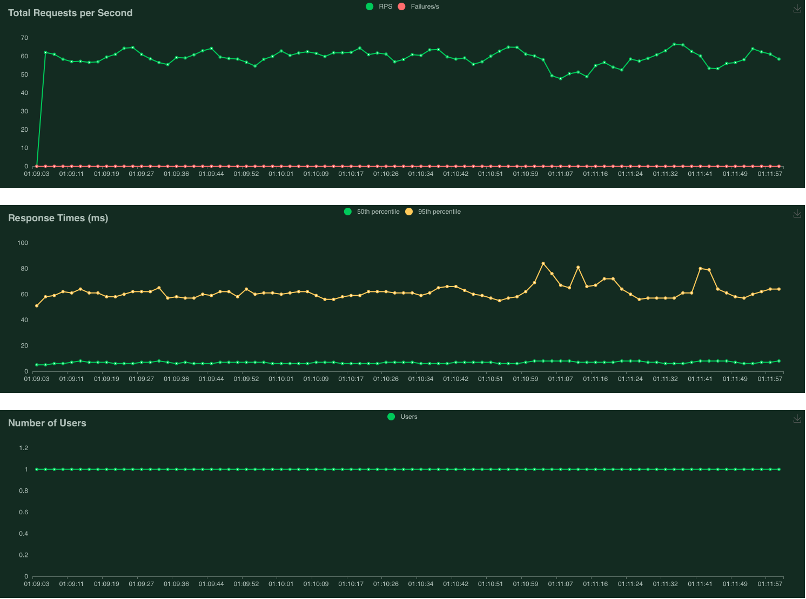
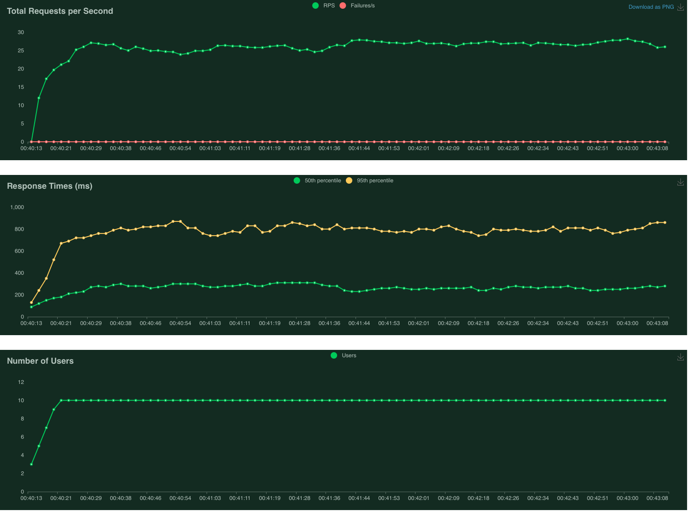
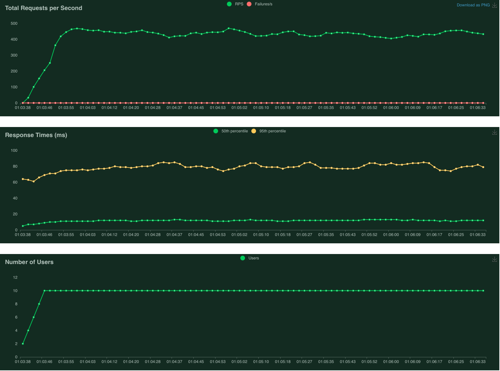
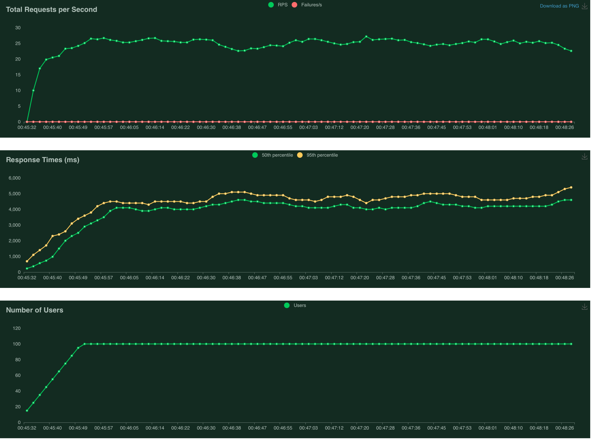
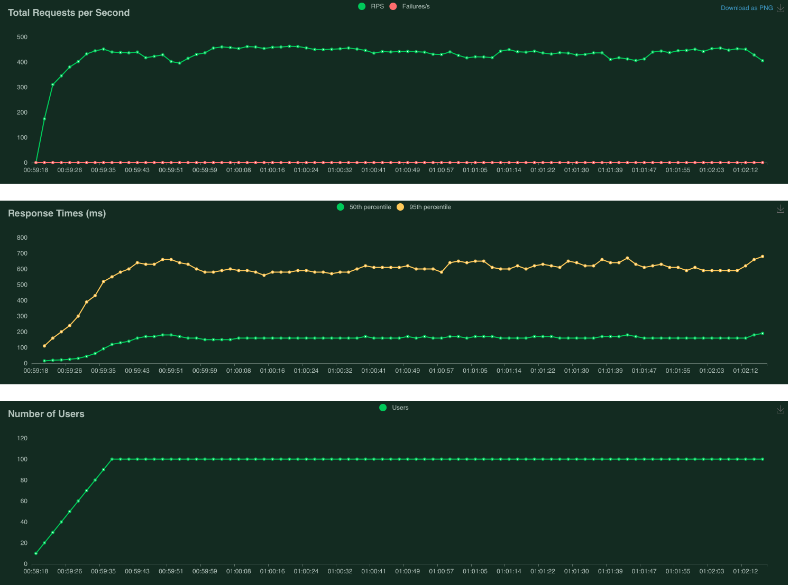
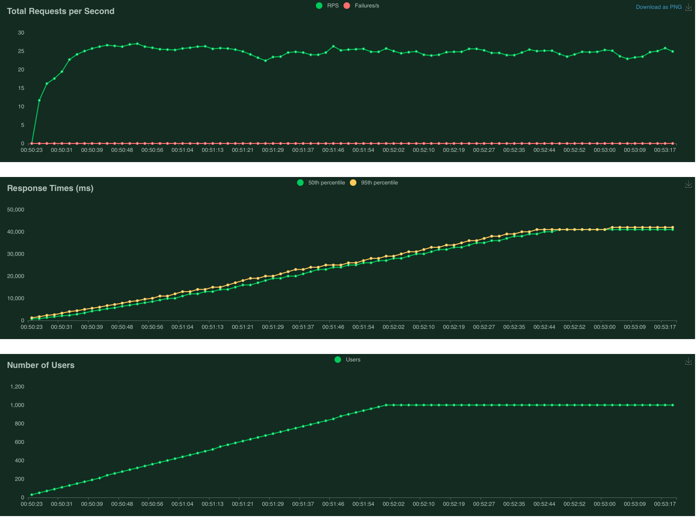
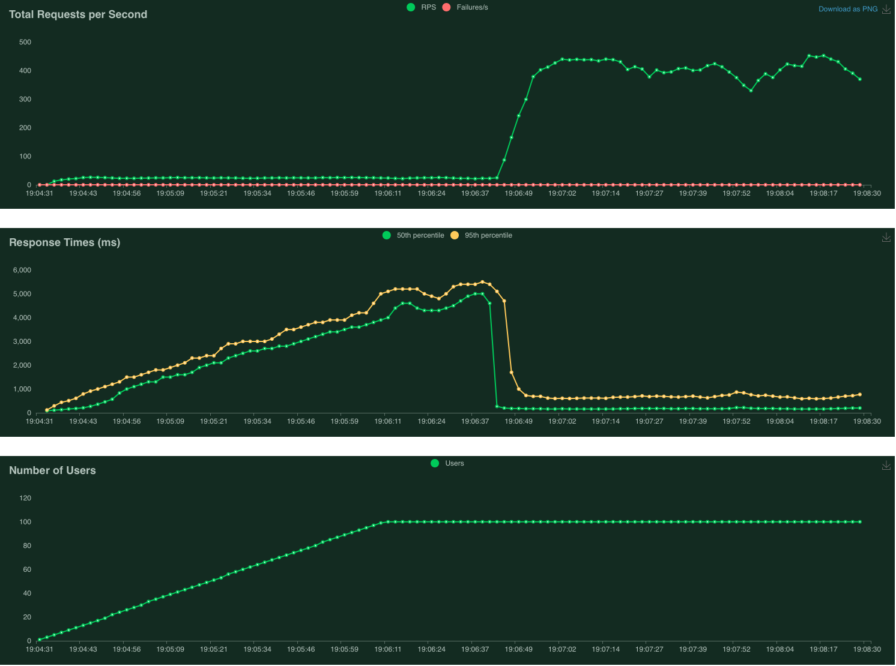

# Производительность индексов  
Данная домашняя работа была направлена на исследование эффективности применения индексов для оптимизации скорости выполнения поисковых запросов к базе данных. В рамках данной работы были выполнены следующие пункты:
1. Был реализован метод поиска анкеты пользователя `GET /user/search/`
2. Были сгенерированы тестовые данные при помощи `Python`-библиотеки `faker`
3. Был проведен отбор префиксов имени/фамилии для реализации реалистичного нагрузочного тестирования с разнообразными данными
4. Было проведено нагрузочное тестирование метода `GET /user/search` с использованием набора подготовленных префиксов
5. Был добавлен составной индекс в базу данных для ускорения поиска по таблице пользователей
6. Было проведено повторное нагрузочное тестирование метода  `GET /user/search` с использованием набора подготовленных префиксов

## Реализация метода `GET /user/search`
Пусть клиентское приложение отправляет запрос `GET /user/search?first_name=Ул&second_name=Ро`. Фактически русский алфавит представлен в виде `url-encoded` строк, но для простоты оставим в исходном виде. Данный метод был реализован при помощи следующего запроса к базе данных:
```sql
SELECT * FROM users WHERE first_name LIKE 'Ул%' and second_name LIKE 'Ро%' ORDER BY id;
```
Больше информации по реализации метода можно получить по ссылке https://github.com/rodinasophie/highload-arch/blob/main/pkg/storage/user.go#L75.

## Генерация данных
Генерация данных была осуществлена при помощи `Python`-библиотеки `faker` следующим скриптом:
```python
import random
from faker import Faker
import csv

fake = Faker('ru_RU')
Faker.seed(0)
with open("people.csv", "w") as csv_file:
    for _ in range(1000000):
        if random.randint(0, 1):
            first_name = fake.first_name_female()
            last_name = fake.last_name_female()
        else:
            first_name = fake.first_name_male()
            last_name = fake.last_name_male()
        line = '\t'.join([first_name, last_name, fake.date_of_birth().strftime('%Y-%m-%d'), fake.city(), ""])
        csv_file.write(line)
        csv_file.write('\n')

```

## Инициализация базы данных
База данных была инициализована миллионом анкет пользователей при помощи следующего метода:
```sql
COPY users(first_name, second_name, birthdate, city)
FROM 'people.csv'
DELIMITER '\t'
CSV HEADER;
```
Данный метод был выбран ввиду его скорости, полная инициализация базы данных заняла меньше 5 минут при таком подходе.

## Выбор инструмента нагрузочного тестирования
Для нагрузочного тестирования был выбран `Python`-фреймворк `locust` по причине его простоты, поддержки скриптовых сценариев, а также наличия всех необходимых метрик для нашего исследования(`RPS`, `latency`).

## Подготовка префиксов
Для корректного проведения нагрузочного тестирования было решено сгенерить набор префиксов, достоверно описывающих данные в базе: необходимо было исключить возможные `404`-ошибки, связанные с запросами, включающими отсутствующие префиксы.

Данная задача была решена при помощи следующего скрипта:
```python

from random import randrange
from random import randint 
import requests
import csv 

def get_random_prefix(prefix_len):
    prefix = ""
    hexLetter = randint(0x0410, 0x042f)   
    prefix += chr(hexLetter)
    for i in range(prefix_len - 1):
        hexLetter = randint(0x0430, 0x044f)   
        prefix += chr(hexLetter)
    return prefix


def select_valid_prefix(prefix_len):
    N = 10000
    k = 0
    valid_prefix = []
    for i in range(1, N):
        firstName = get_random_prefix(prefix_len)
        secondName = get_random_prefix(prefix_len)
        url = f"http://localhost:8083/user/search?first_name={firstName}&second_name={secondName}"
        try:
            r = requests.get(url)
            if r.status_code == 200:
                valid_prefix.append([firstName, secondName])
        except requests.ConnectionError:
            print("failed to connect")
        k += 1
        if k % 100 == 0:
            print(str(k) + "/" + str(N) + " prefixes are handled, valid_prefixes[]: " + str(valid_prefix))
    return valid_prefix

valid_prefix = select_valid_prefix(1) # 2, 3

with open('prefix.csv', 'a', ) as f:
    for item in valid_prefix:
        writer = csv.writer(f, delimiter=',')
        writer.writerow(item)
``` 
Необходимо отметить, что чем длиннее искомый префикс, тем большее число операций требуется для нахождения одного "валидного" префикса, так как сложность поиска увеличивается геометрически. Были найдены одно-, двух- и трехбуквенные префиксы и записаны в файл `prefix.csv`.

## Нагрузочное тестирование
Для проведения нагрузочного тестирования использовался следующий простейший скрипт, описывающий отправку подготовленных префиксов в запросе `GET /user/search`:
```python
import random
import string
from locust import HttpUser, task
import pandas as pd
from locust_plugins.csvreader import CSVReader

prefix_reader = CSVReader("prefix.csv")

class PerfTesting(HttpUser):
    @task
    def perf_testing(self):
        prefix = next(prefix_reader)
        firstName = prefix[0]
        secondName = prefix[1]
        self.client.get(f"/user/search?first_name={firstName}&second_name={secondName}")

```
Следующие метрики были собраны в рамках нагрузочного тестирования:
1. `RPS(requests per second), throughput` - количество запросов, обработанных системой в секунду, пропускная способность системы.
2. `Latency, response time` - время ответа на запрос пользователя(в нашем исследовании используются 50 и 95 персентили).

**Замечание:** несмотря на некие формальные отличия метрики `latency` от `response time`, в данном исследовании эти метрики используются, как синонимы, ввиду сохранения общего смысла исследования при такой замене.

Каждый тест проводился в течение 3 минут и при следующем количестве одновременных пользователей: 1/10/100/1000.

### Базовый метод
В качестве базового сценария использовался вариант конфигурации базы данных, при котором данные имеют только один номинальный индекс, связанный с первичным ключом таблицы, что не является эффективым решением для задачи поиска по префиксам имени/фамилии.
`EXPLAIN`-запрос для данного сценария:
```sql
social_net=# EXPLAIN ANALYZE SELECT * FROM users WHERE first_name LIKE 'Ул%' AND second_name LIKE 'Ро%' ORDER BY id; 
                                                         QUERY PLAN                                                          
-----------------------------------------------------------------------------------------------------------------------------
 Gather Merge  (cost=52493.71..52507.24 rows=116 width=72) (actual time=354.335..355.483 rows=270 loops=1)
   Workers Planned: 2
   Workers Launched: 2
   ->  Sort  (cost=51493.69..51493.83 rows=58 width=72) (actual time=342.041..342.044 rows=90 loops=3)
         Sort Key: id
         Sort Method: quicksort  Memory: 37kB
         Worker 0:  Sort Method: quicksort  Memory: 37kB
         Worker 1:  Sort Method: quicksort  Memory: 37kB
         ->  Parallel Seq Scan on users  (cost=0.00..51491.99 rows=58 width=72) (actual time=4.762..338.218 rows=90 loops=3)
               Filter: (((first_name)::text ~~ 'Ул%'::text) AND ((second_name)::text ~~ 'Ро%'::text))
               Rows Removed by Filter: 666576
 Planning Time: 0.824 ms
 Execution Time: 355.543 ms
(13 rows)
```
Мы видим, что наш запрос использует самый неэффективный способ поиска `Sequential Scanning`, который подразумевает просто последовательный проход по всем данным.

### Индекс
Для оптимизации поиска по таблице пользователей был использован следующий индекс:
```sql
CREATE INDEX IF NOT EXISTS users_idx ON users(first_name, second_name);
```
Данный индекс является составным и по умолчанию реализован на основе B-дерева, что позволяет использовать преимущества range-поиска для поиска пользователей по префиксу.
`EXPLAIN`-запрос для данного сценария:
```sql
social_net=# EXPLAIN ANALYZE SELECT * FROM users WHERE first_name LIKE 'Ул%' AND second_name LIKE 'Ро%' ORDER BY id; 
                                                                                  QUERY PLAN                                                                                   
-------------------------------------------------------------------------------------------------------------------------------------------------------------------------------
 Sort  (cost=281.35..281.70 rows=138 width=72) (actual time=4.768..4.791 rows=270 loops=1)
   Sort Key: id
   Sort Method: quicksort  Memory: 62kB
   ->  Index Scan using users_idx on users  (cost=0.43..276.45 rows=138 width=72) (actual time=0.235..4.568 rows=270 loops=1)
         Index Cond: (((first_name)::text >= 'Ул'::text) AND ((first_name)::text < 'Ум'::text) AND ((second_name)::text >= 'Ро'::text) AND ((second_name)::text < 'Рп'::text))
         Filter: (((first_name)::text ~~ 'Ул%'::text) AND ((second_name)::text ~~ 'Ро%'::text))
 Planning Time: 0.555 ms
 Execution Time: 5.183 ms
(8 rows)
```
Мы видим, что при выполнении данного запроса, план запроса изменился и база использует индекс для поиска данных. Это более эффективный способ поиска, позволяющий отсматривать минимальное число нерелевантных поисковому запросу данных.

## Анализ результатов
Итак, в рамках данного исследования было проведено 8 запусков тестового сценария, длящихся на протяжении 3 минут каждый:
1. До создания индекса: число пользователей: `1/10/100/1000`
2. После создания индекса: число пользователей: `1/10/100/1000`

Следующие графики были получены в рамках нагрузочного тестирования:

###### Пользователей: 1
No Index             |  Index Enabled
:-------------------------:|:-------------------------:
 | 


###### Пользователей: 10
No Index             |  Index Enabled
:-------------------------:|:-------------------------:
 | 


###### Пользователей: 100
No Index             |  Index Enabled
:-------------------------:|:-------------------------:
 | 

###### Пользователей: 1000
No Index             |  Index Enabled
:-------------------------:|:-------------------------:
 | 

Была получена следующая сводная таблица результатов:

|Number of users|RPS before index| RPS after index| Latency before index(50th,95th)| Latency after index(50th,95th)|
|--|--|--|--|--|
| 1 | 14.5| 56.4 | 50th: ~70ms, 95th: ~130ms | 50th: ~12ms, 95th: ~70ms |
| 10 | 25.8| 432.9 |  50th: ~300ms, 95th: ~800ms | 50th: ~15ms, 95th: ~90ms |
| 100 | 23.4| 405.8 |  50th: ~4s, 95th: ~5s | 50th: ~100ms, 95th: ~700ms |
| 1000 | 25.4| 367.1 |  50th: ~50s, 95th: ~50s | 50th: ~2s, 95th: ~5s |


Видно, что после добавления индекса пропускная способность системы увеличилась 4-18 раз(в зависимости от числа одновременных пользователей), а время ответа на запрос снизилось в 6-40 раз(в зависимости от числа одновременных пользователей). Выбранный индекс эффективно решает задачу оптимизации поиска анкеты пользователя.

## Выводы

В рамках проведенного исследования был обнаружен ощутимый рост производительности запроса `GET /user/search` при использовании составного индекса по полям `first_name` и `second_name`. Метрики `latency` и `RPS`, связанные с эффективностью поиска это подтверждают. В рамках реального времени также легко увидеть значительное изменение показателей системы при создании индекса на следующем графике(для 100 пользователей):

Момент смены тренда на графиках - это момент создания индекса в базе данных.