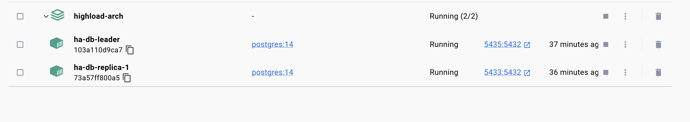
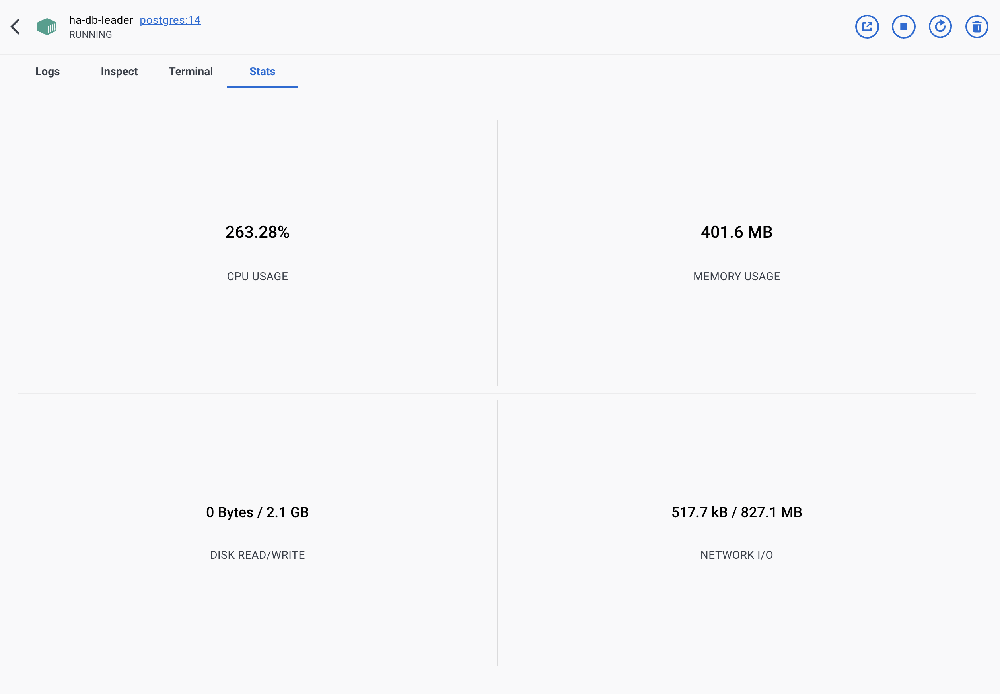
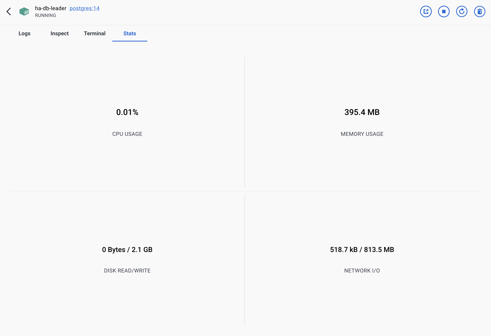
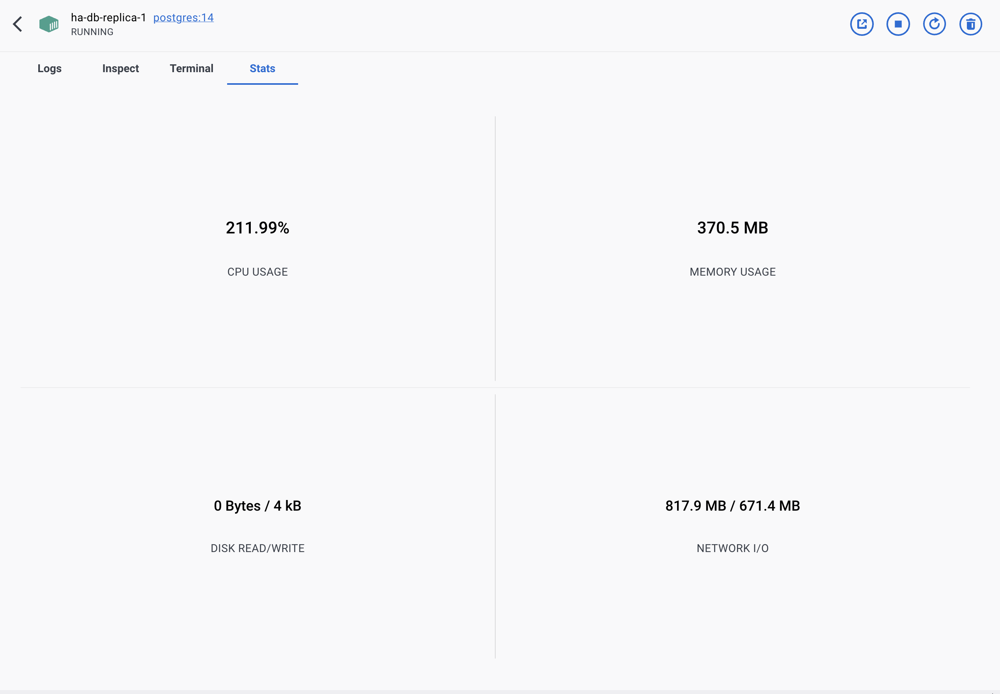

# Репликация базы данных  
Данная домашняя работа была направлена на исследование действия синхронной и асинхронной репликации в PostgreSQL. В рамках данного задания были проделаны следующие шаги:
Асинхронная репликация:
1. Настройка асинхронной репликации базы данных системы на одну реплику
2. Перенаправка трафика по запросам `/user/get/{id}` и /`user/search` на реплику
3. Проведено нагрузочное тестирование для методов `/user/get/{id}` и `/user/search`

Синхронная репликация:
1. Настройка синхронной репликации базы данных системы на 2 реплики
2. Нагрузка на запись к базе данных
3. Симуляция падения лидера
4. Перенос лидера на одну из реплик и переконфигурирование другой реплики с прошлого лидера на новый
5. Проверка сохранности данных на новом кластере

## Асинхронная репликация  
### Подготовка стенда
1. Включение асинхронной репликации на лидере(`ssl = off
wal_level = replica, max_wal_senders = 4`)
2. Прописываем лидера на реплике(`primary_conninfo`), добавляем файл `stabdby.signal`
3. Используем `.pgpass` для возможности обращаться к базе без введения пароля
4. Добавляем бэкап кластера баз данных для корректного запуска реплики
5. Инициализируем базу данных на лидере
6. Запускаем реплику
7. Запускаем агент бэкенда

Конфигурация кластера базы данных:


### Нагрузочное тестирование
1. Запускаем скрипт нагрузочного тестирования с параметром `USE_REPLICA = false`, вся нагрузка в данном режиме будет направлена на лидера кластера(реплика не используется).
Проверяем нагрузку хоста в этот момент:

Видно, что хост нагружен.

2. Выставляем параметр `USE_REPLICA = true`, при данном параметре нагрузка по запросам  `/user/get/{id}` и `/user/search` будет направлена на реплику.
Проверяем нагрузку лидера в этот момент:


Проверяем нагрузку реплики в этот момент:


Видно, что в данном режиме реплика предельно нагружена при тестировании, а узел лидера остается свободным, трафик был перенаправлен.

## Cинхронная репликация  
В рамках синхронной репликации была настроен кластер баз данных, состоящий из одного лидера(`synchronous_commit, synchronous_standby_names`) и двух синхронных реплик.
### Нагрузка на запись
Данный кластер был нагружен простейшим скриптом на регистрацию большого числа новых пользовтелей и подсчет числа зарегистрированных пользователей:
```python
import requests
count = 0
try:
    while True:
        r = requests.post('http://localhost:8083/user/register', json={"first_name": "Имя","second_name": "Фамилия",
    "birthdate": "2017-02-01","biography": "Хобби, интересы и т.п.","city": "Москва","password": "Секретная строка"})
        if r.status_code == 200:
            count += 1
        else:
            break
except:
    print(count)

print(count)

```
Все пользователи имели системное имя `'Имя'` и могут быть найдены в базе простым select-запросом.

### Симуляция падения лидера
После прерывания хоста, исполняющего роль лидера в кластере, запись в кластер прерывается и мы видим результирующее число зарегистрированных в рамках нашего скрипта пользователей:
```shell
sonya@MacBook-Pro-Sofia highload-arch % make load-for-write
python3 perf-testing/load.py
637
```

### Восстановление кластера в новой конфигурации
Выбираем первую реплику для выдвижения в лидеры:
```sql
ALTER SYSTEM SET synchronous_standby_names = 'ANY 1 (pgslave)';
ALTER SYSTEM SET synchronous_commit = on;
select pg_reload_conf();
select pg_promote();
```
Вторую реплику подключаем к первой в качестве реплики при помощи модификации `primary_conn_info`.

Видим, что кластер стартует и новый лидер успешно заработал, реплика также начала получать данные. Подключаемся к новому лидеру и проверяем число записей, имеющих системное имя `'Имя'`:
```sql
social_net=# SELECT count(*) FROM users WHERE first_name='Имя';
 count 
-------
   637
(1 row)
```

Видим, что при синхронной репликации потери данных на лидере не случилось.

## Выводы  
В рамках данной работы были использованы два режима репликации в PostgreSQL: асинхронный и синхронный. При асинхронной репликации было проведено исседование по перенаправлению трафика с лидера на реплику и графики нагрузки хостов подтвердили успешность данного действия. При синхронной репликации, выяснено, что падение лидера не приводит к потере данных, что закономерно, посколько PostgreSQL в синхронном режиме не применяет данные на лидере до тех пор, пока они не были примерены на синхронных репликах.