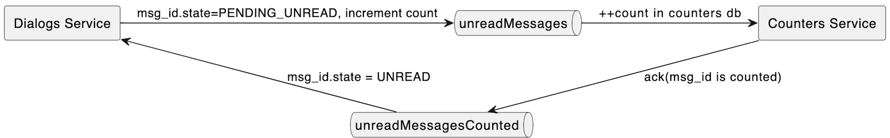
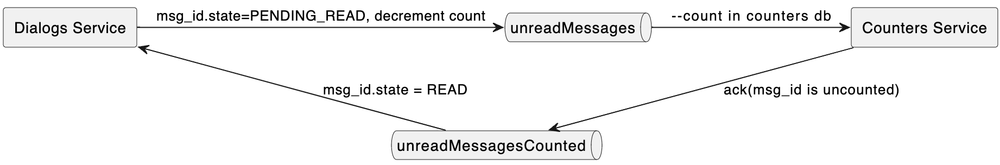

# Распределенные транзакции

В рамках данной домашней работы было предложено исследовать паттерны распределенных транзакций в микросервисных архитектурах и применить паттерн SAGA для реализации механизма распределенных транзакций в учебном проекте. В текущем проекте присутствуют следующие микросервисы:
1. Backend - основной сервис системы
2. Dialogs - микросервис, отвечающий за хранение системы диалогов(сообщений пользователей)
3. Counters - микросервис счетчиков, подсчитывает непрочитанные сообщения

## Разворачивание
Backend:
```make docker-reset && make docker-init && make docker-backend && make docker-run-backend```
Dialogs:
`make docker-dialogs-db && make docker-dialogs && make docker-run-dialogs`
Counters:
`make docker-counters-db && make docker-counters && make docker-run-counters`

## Логика работы
В текущей конфигурации присутствуют два связанных микросервиса: микросервис диалогов и микросервис счетчиков. Необходимо научиться проводить транзакции, добавляющие новые сообщения в подсистему диалогов таким образом, чтобы сервис счетчиков увеличивал счетчик непрочитанных сообщений, а также выставлять признак "Прочитано" существующим сообщениям таким образом, чтобы сервис счетчиков уменьшал значение счетчика непрочитанных сообщений для данного диалога.

Для реализации данных целей были добавлены две очереди:
1. `unreadMessages` - сообщения в данный топик пишутся сервисом диалогом при вызове эндпоинта  `/dialog/{user_id}/send` и вычитываются на стороне сервиса счетчиков для увеличения счетчика для данного диалога. В качестве `rountingKey` используется `author_id.recepient_id`. При добавлении нового сообщения, сообщение переходит в статус `PENDING_UNREAD`.
2. `unreadMessagesCounted` - данный топик используется для ответов со стороны сервиса счетчиков и соответственно сервис счетчиков пишет в топик сообщения о том, что некое сообщение было учтено в подсчете непрочитанных сообщений, а сервис диалогов, при получении данного сообщения, выставляет сообщению статус `UNREAD`.

Аналогичным образом через вышеописанные топики реализуется и логика "прочтения" сообщения. В текущей имплементации нет отдельного механизма пометки сообщения прочитанным со стороны клиента и все сообщения, которые могут быть возвращены эндпоинтом `/dialog/{user_id}/list` отмечаются прочитанными при вызове данного эндпоинта(см. ключ `MARK_AS_READ_ON_LISTING`). Кандидат на прочтение переводится в статус `PENDING_READ`, после этого уменьшается счетчик непрочитанных сообщений на стороне сервиса счетчиков и сообщение переходит в статус `READ`. Условия перевода сообщения в статус "Прочитано" могут быть изменены, но логика обновления статуса через паттерн `SAGA` останется неизменной и может быть переиспользована. Ознакомиться подробнее с реализацией можно в разделах `dialogs_service.storage.saga_*.go` и `counters_service.storage.saga_*.go`

## Cхема БД сервиса счетчиков
```sql

CREATE TABLE IF NOT EXISTS unread_messages (
    id UUID DEFAULT uuid_generate_v4(),
    author_id UUID NOT NULL, 
    recepient_id UUID NOT NULL,
    count INTEGER DEFAULT 1 NOT NULL,
    PRIMARY KEY(author_id, recepient_id) 
);
```

## Архитектурная диаграмма
### Saga: increment count

### Saga: decrement count


